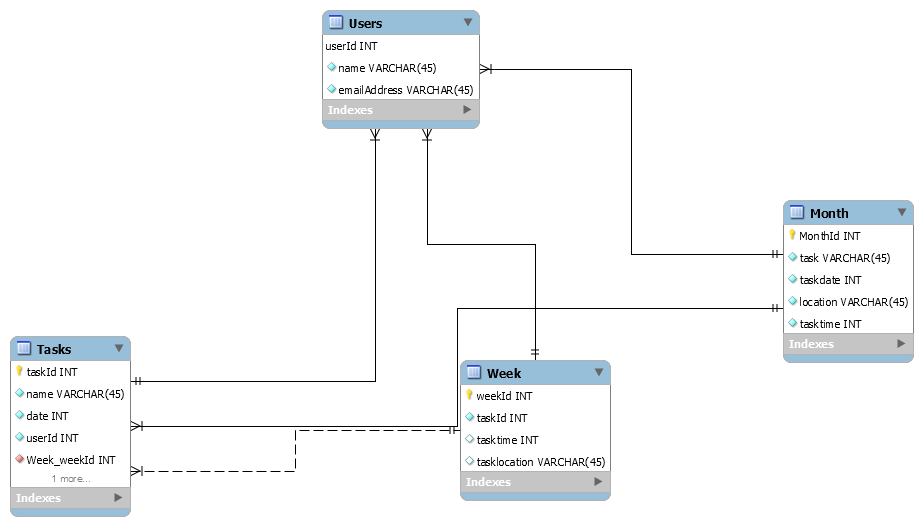

# Planner-capstone
Front End Capstone: Daily planner

What does the Daily planner do? The Daily planner will allow users to use an app instead of a bulky paper planner to keep track of all of the things you would normally see in a day planner. It will keep basic information about tasks, appointments, vehicle maintenance and an address book all in one place. It will allow the user to create an account and use the tools in the app to organize their month and week.

MVP:

The planner will have a month at a glance view and a weekly view.

The weekly view will have link to the to do list that will also show up on the monthly view. All entries can be edited and deleted.

The to do list will list the most immediate tasks first and the current day's tasks a different color.

monthly calendar as a table

Create a Json database

Stretch goals: big view calendar A section for names and addresses. The weekly view will be able to import addresses for appointments.

adding an outside API that populates the monthly calendar with daily weather information. A checkbox to check of tasks in the to do list instead of just deleting them Populating the monthly view with the tasks from the weekly view and those tasks show they are checked off when they are completed. Addin other sections to the journal-like a grocery list.

Components:

weekly view
task list
monthly calendar

Dependencies:

The task list will have information-the information in state the information from that list will be passed as props to the monthly and weekly views.
tasks are created and then passed as props to the details and edit function

.

